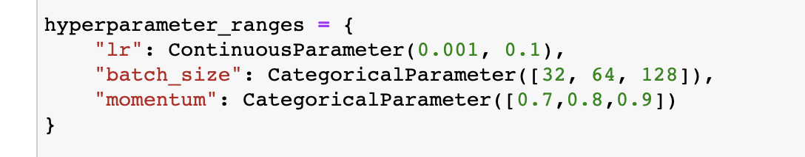
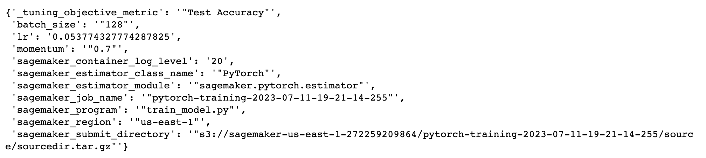
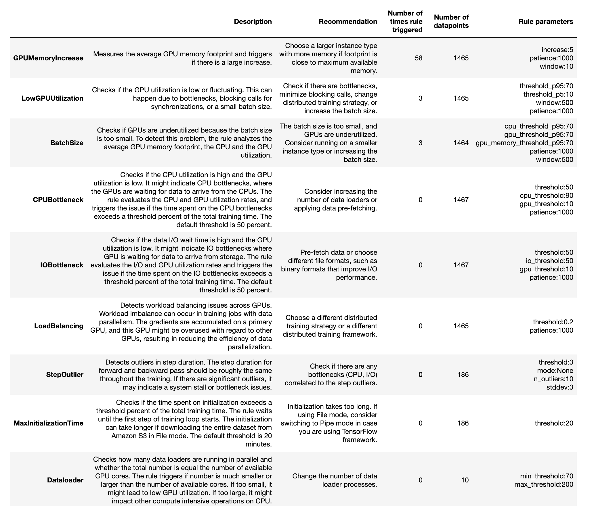
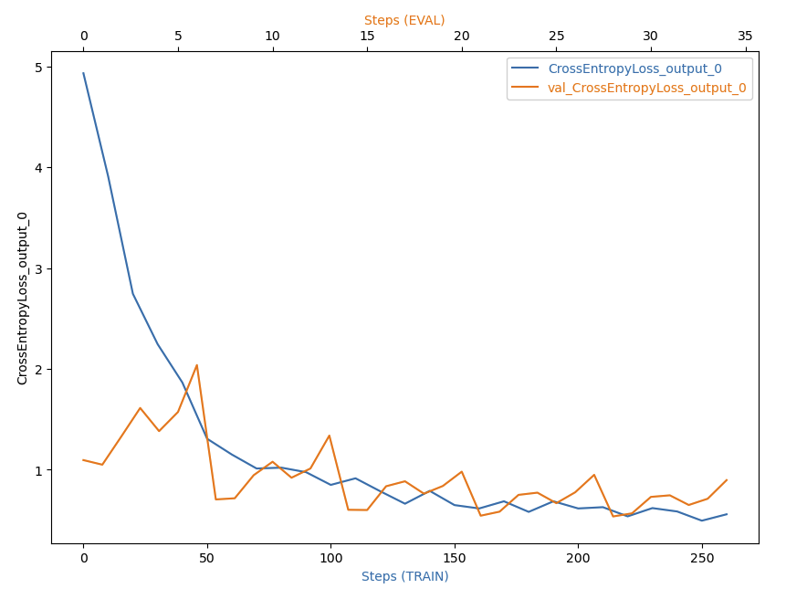
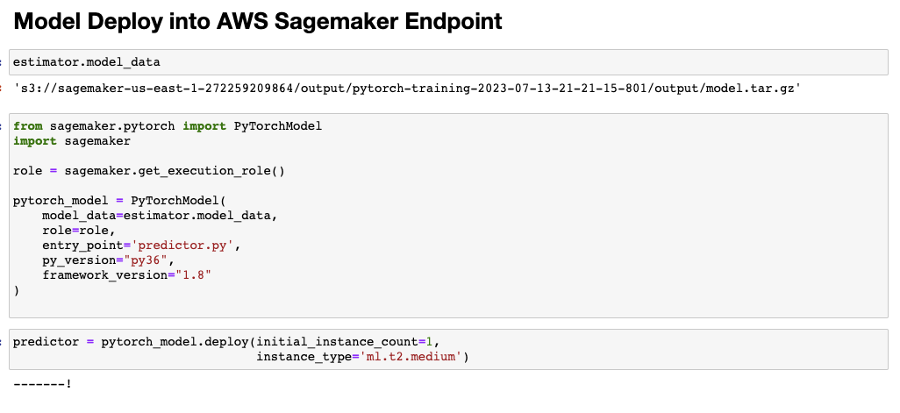
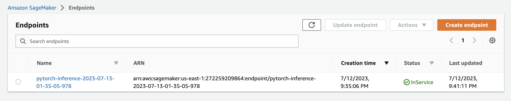
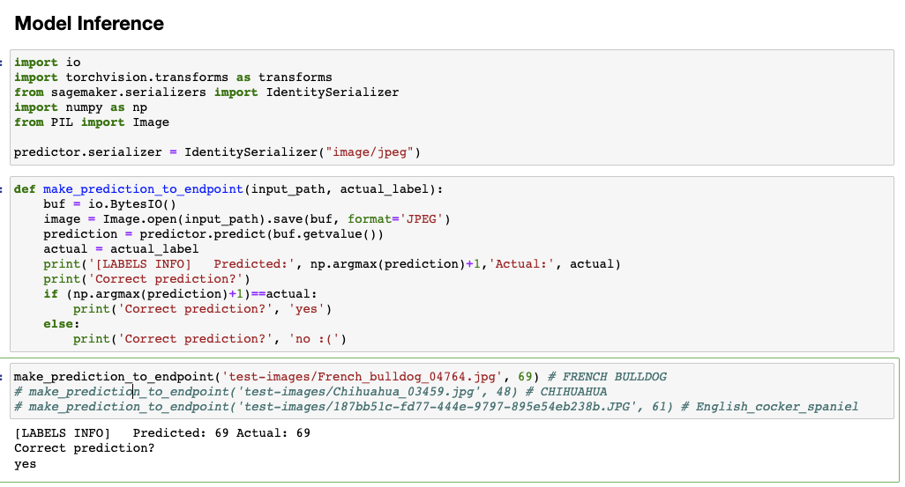

# Image Classification using AWS SageMaker

This project will use the DogImages dataset to train, test, and deploy a CNN model on top of a ResNet50 model using transfer learning using AWS Sagemaker and Python code.

This project will perform the following tasks:
- Upload the dataset to S3 so it can be used by multiple instances
- Hyperparameter Tuning to search the best parameter configuration for the model
- Use debugging and profiling with the best selected model
- Deploy the model into a Sagemaker endpoint
- Perform inferences with never seen images using the endpoint

## Project Set Up and Installation
You need to have a valid AWS account and access to Sagemaker, S3 and Cloud Watch in the platform to execute this code.
First download the repository. The key files are as follows:
- `train_and_deploy.html`: jupyter notebook with all the details for image classification in AWS Sagemaker in HTML format
- `train_and_deploy.ipynb`: jupyter notebook with all the details in Jupyter Notebook format
- `hpo.py`: this is the entry point to perform hyperparameter tuning
- `train_model.py`: this is similar to `hpo.py` but it has a hook attached to it to perform profiling and debugging
- `predictor.py`: this file is used to create the model that will be deployed and also performs pre-process to the images sent for inference
- `img`: some screenshots used in this report
- `ProfilerReport`: report generated by using profiler in Sagemaker
- `test-images`: images used for making the predictions using the deployed model.

## Dataset
The provided dataset is the dogbreed classification dataset which is provided by Udacity. It contains train, test, and validation images of 133 types of dogs. It is used for classification. 

### Access
The dataset is uploaded to an S3 bucket through the AWS Gateway so that SageMaker has access to the data.

## Hyperparameter Tuning
For this purpose, the ResNet50 was choosen and 3 parameters of it were fine tuned: the learning rate, the momentum and the number of epochs. 4 jobs where created (max 2 jobs running in parallel) running different hypothesis of the hyperparameters.

The parameters were in the following ranges:

Here are the hyperparameters jobs that ran successfully:
!(Hyperparameter Tuning Jobs)[img/hyperparams.png]

Here are the training jobs that ran successfully:

The best parameter configuration found was as follows:

## Debugging and Profiling
For debugging and profiling it is important to define the rules (such as vanishing gradient, overfiting, LowGPUUtilization, etc.) together with how offent we want to capture some information about CPU/GPU consumption. It's needed that the entry script has attached a hook to it that captures different information about it.

### Results

In the profiler report generated we can see that the GPU Memory Increase alert was triggered several times. This indicates that there was a large increase in the GPU and it can be solved by chossing a larger instance for training. We also can see that the Low GPU Utilization and the Batch Size alerts were trigger several times. This information indicates that our model presented some problems while training in the choosen instance.

For debugging the model it is important to define a `collection_configs` object where we define the tensor name that we want to debug togetter with how offen we want to capture that information for training and testing using the `train.save_interval` and `test.save_interval` configuration variables.

After training we can get loss values for the different steps for train/test and we can plot it as follows:

We can see how the loss decreases over time for both train/test datasets which is good sign that our model is training correctly.

## Model Deployment
In order to deploy a model we need to create a `PyTorchModel` with the recently trained model artifact path in S3, the role, the framework version, the python version and finally an script entry point that will contain code to load the model weights and do some preprocessing to the image before passing it to the CNN.

A screenshot of the deployment process is shown below: 

We can also verify that our endpoint is active in the AWS console. 

## Model Inference

In order to do an inference we can call the predictor object returned after deploying the model together with the image stored in buffer. The predictor will return the prediction as an array of probabilities for each class. We can simply take the position where the probability is higher, that will indicate the predicted class. 

An screenshot of the prediction is shown here:

We can see how the image was sent to the end point, it was transformed and passed to the CNN to make a prediction which was returned back to us.

